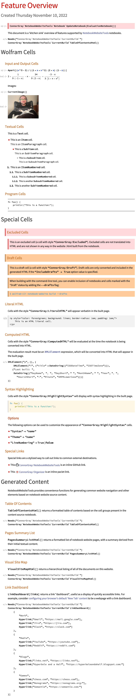

<!-- NOTE: This strangely named .nb.png.md is a workaround for the fact that
    directly linking to feature-overview.nb.png from README.md has bad UX, because
    when viewing a .png file directly, GitHub doesn't constrain the width of the
    image to fit within the current browser window viewport; and in the case
    of feature-overview.nb.png, that image ends up much wider than even a large
    browser window, so the reader has to manually zoom out, or haphazardly
    horizontally scroll through the notebook image to see all of its content.)

    BUT, when an image is embedded in a .md file (like this one), then GitHub
    DOES constrain the width of the image, so the full image is much easier to
    see. This works well for images of notebooks, whose aspect ratio is similar
    to a typical browser window.
-->

